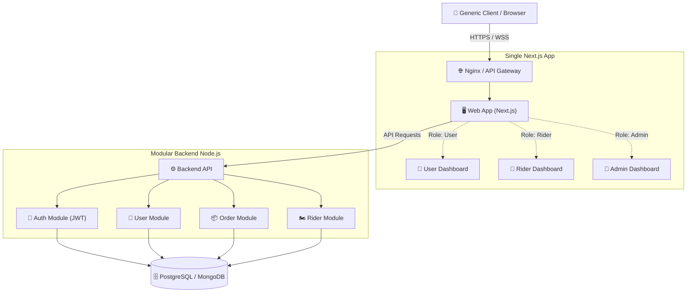

# 🏗️ Multi-Portal Architecture Redesign

Based on your current setup where `.next`, `.next_admin`, and `.next_rider` are fighting for resources, we are shifting to a **Role-Based Single Application (Core Frontend)** interacting with a **Unified Modular Backend** inside a **Turborepo** setup. 

This drastically reduces dev overhead, eliminates the need for running multiple watcher processes, and provides a scalable base.

---

## 1. 🗺 Architecture Diagram



---

## 2. 📂 Folder Structure

We leverage a **Turborepo** monorepo to maintain strong separation of concerns while maximizing code sharing.

```text
/
├── apps/
│   ├── web/                     # 🖥️ The SINGLE Next.js Frontend App
│   │   ├── src/app/
│   │   │   ├── (auth)/          # Public auth pages (login, register)
│   │   │   ├── (dashboards)/    # Protected Root Group
│   │   │   │   ├── admin/       # Only accessible by Admin
│   │   │   │   ├── rider/       # Only accessible by Rider
│   │   │   │   └── user/        # Only accessible by User
│   │   │   ├── layout.tsx       # Root layout
│   │   │   └── middleware.ts    # 🔐 Handles RBAC Logic before rendering!!
│   │   ├── package.json
│   │   └── next.config.mjs
│   │
│   └── api/                     # ⚙️ The SINGLE Backend App (Express/NestJS)
│       ├── src/
│       │   ├── modules/
│       │   │   ├── auth/        # Login, JWT issuing, Hash verification
│       │   │   ├── users/       # CRUD for users
│       │   │   ├── orders/      # Orders business logic
│       │   │   └── riders/      # Rider location/tracking logic
│       │   ├── middlewares/     # `requireRole(['admin'])` logic
│       │   └── server.ts
│       └── package.json
│
├── packages/                    # 📦 Shared Code (Write once, use everywhere)
│   ├── ui/                      # Shared React components (Buttons, Inputs, Tables)
│   ├── ts-config/               # Shared TS configs (`tsconfig.base.json`)
│   ├── eslint-config/           # Shared linting rules
│   └── schemas/                 # Shared Zod / Yup validators (used in BOTH api + web)
│
├── package.json                 # Monorepo root
└── turbo.json                   # Turborepo task pipeline config
```

### Folder Explanations:
- `apps/web`: The unified Next.js application that contains routes for all 3 portals mapped through dynamic RBAC folders.
- `apps/api`: The unified Node.js API that serves the web app.
- `packages/ui`: The visual heart of the UI. Avoid duplicate specific buttons/branding across portals.
- `packages/schemas`: Shared API request/response types (e.g., standardizing `CreateOrderPayload`) so the frontend and backend strictly adhere to the same schema.

---

## 3. 🛠 Tech Stack Justification

| Layer | Technology | Justification |
| :--- | :--- | :--- |
| **Monorepo** | **Turborepo** | Highly cached build system. Reduces re-builds, allows running both frontend and backend concurrently with minimal memory usage. |
| **Frontend UI** | **Next.js (App Router)** | Best-in-class performance. Middleware allows intercepting routes pre-render for secure RBAC. |
| **Frontend Styling**| **TailwindCSS + Framer Motion**| Extremely fast design system implementations, avoids CSS-in-JS runtime overhead. |
| **Backend** | **NestJS** (or Express w/ Controllers) | NestJS inherently enforces modular domain-driven design (`auth/`, `order/`). If using Express, strict MVC / Domain folder structure is required. |
| **State Mgt** | **Zustand / React Query** | Zustand avoids context re-render hell. React Query perfectly tracks asynchronous state/cache from the backend API. |
| **Auth** | **JWT via HTTPOnly Cookies** | Max security, avoids XSS, allows `middleware.ts` in Next.js to parse the role from JWT and route automatically. |

---

## 4. 👟 Step-by-Step Setup Guide

**Step 1: Bootstrap Turborepo**
```bash
npx create-turbo@latest pet-shop-monorepo
```
*Choose npm/yarn/pnpm (pnpm is highly recommended for speed).*

**Step 2: Clean the default apps**
Delete the default `docs` and `web` templates. Create fresh apps:
```bash
cd pet-shop-monorepo/apps
npx create-next-app@latest web
# (Configure with App Router, Tailwind)
```
```bash
mkdir api && cd api
npm init -y
npm install express cors dotenv
npm i -D typescript @types/express tsx
# (Initialize basic modular express structure)
```

**Step 3: Setup RBAC Middleware (Next.js)**
In `apps/web/src/middleware.ts`, verify the JWT Role:
```typescript
import { NextResponse } from 'next/server';
import type { NextRequest } from 'next/server';

export function middleware(req: NextRequest) {
  const token = req.cookies.get('auth_token')?.value;
  // Decode JWT to get role (use jose or secure decoding)
  const role = getRoleFromToken(token); 
  
  const path = req.nextUrl.pathname;

  if (path.startsWith('/admin') && role !== 'ADMIN') {
    return NextResponse.redirect(new URL('/unauthorized', req.url));
  }
  if (path.startsWith('/rider') && role !== 'RIDER') {
    return NextResponse.redirect(new URL('/unauthorized', req.url));
  }
  return NextResponse.next();
}
```

---

## 5. 💻 Dev Commands & Workflow Optmization

Instead of running `npm run dev` 3 times crashing the CPU:

Setup `turbo.json`:
```json
{
  "$schema": "https://turbo.build/schema.json",
  "pipeline": {
    "build": {
      "dependsOn": ["^build"],
      "outputs": [".next/**", "dist/**"]
    },
    "dev": {
      "cache": false,
      "persistent": true
    }
  }
}
```

Root `package.json`:
```json
"scripts": {
  "dev": "turbo run dev --parallel",
  "build": "turbo run build"
}
```

To run everything at once globally with extreme optimization (Next.js + Node backend):
```bash
npm run dev
```

*(This runs single Next.js + single Backend. Drastic reduction in CPU overhead vs 3 separate Next.js instances).*

---

## 6. 🏆 Best Practices for Mac Performance & Scalability

1. **Avoid Excessive Watchers**: Multi-Next.js instances (`.next_admin`, `.next_rider`) span thousands of file watchers. Unified Next.js has exactly ONE watcher pool.
2. **Dynamic Imports for large charts**: Only the Admin needs charts? Use `next/dynamic` so the user and rider bundle doesn't get bloated by admin dependencies.
   ```tsx
   const AdminChart = dynamic(() => import('@/components/AdminChart'), { ssr: false })
   ```
3. **Use React Query**: Don't use `useEffect` loops to fetch orders. React Query implements stales-while-revalidate and prevents unnecessary re-rendering across dashboards.
4. **Use Shared Schema Validation**: Define Zod schemas in `packages/schemas`. Import the EXACT SAME validator in the frontend for form validation (`react-hook-form + zodResolver`) and backend for API validation middleware.
5. **UI Golden Ratio**: Build standard `packages/ui` components (e.g. `<Button>`, `<Card>`) strictly defining `sm`, `md`, `lg` spacing constraints to ensure the entire site feels premium without arbitrary margins.
